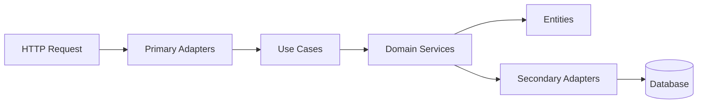

<div align="center">
    <h1>Visionary Backend 🚀</h1>


A high-performance, scalable backend service built with Rust, featuring clean architecture and modern observability tools.

Features • Architecture • Getting Started • API Documentation • Development

</div>

---

## 📋 Table of Contents

- ✨ Features
- 🏗️ Architecture
- 🚀 Getting Started
- 📚 API Documentation
- 🛠️ Development
- 🔐 Security
- 📊 Monitoring
- 🤝 Contributing
- 📄 License

## ✨ Features

### 🎯 Core Capabilities

- **🔥 High Performance**: Built with Rust for blazing-fast performance and memory safety
- **🏛️ Clean Architecture**: Hexagonal architecture with clear separation of concerns
- **📦 Modular Design**: Domain-driven design with independent modules
- **🔄 Async/Await**: Fully asynchronous request handling with Tokio runtime
- **✅ Input Validation**: Robust validation using the validator crate

### 💾 Database Support

- **MongoDB**: Primary database for flexible document storage
- **ScyllaDB**: High-performance distributed database for time-series data
- **🔄 Repository Pattern**: Abstracted database operations with swappable implementations

### 🔒 Security Features

- **🔑 OAuth 2.0**: Integration with OAuth client authentication
- **🔐 Asymmetric Encryption**: RSA and EC key pair generation support
- **🛡️ Input Sanitization**: Protection against injection attacks

### 📊 Observability

- **📈 Prometheus Metrics**: Built-in metrics collection and export
- **🔍 Distributed Tracing**: Monitor request flows across services
- **📝 Structured Logging**: Comprehensive logging for debugging

## 🏗️ Architecture

### Project Structure

```
visionary-backend/
├── 📁 modules/
│   ├── 🎯 adapters/          # Primary & Secondary adapters
│   │   ├── primary/          # HTTP routes, controllers
│   │   └── secondary/        # Database repositories
│   ├── 💼 domain/            # Business logic & entities
│   │   ├── entities/         # Domain entities
│   │   ├── services/         # Domain services
│   │   ├── usecases/         # Use case definitions
│   │   └── repositories/     # Repository interfaces
│   ├── 🔧 processors/        # Proc macros & code generation
│   └── 🔗 shared/            # Shared utilities
│       ├── cryptography/     # Encryption utilities
│       └── models/           # Common models
├── 🔐 keys/                  # Cryptographic keys
├── 🗄️ migrations/            # Database migrations
├── 🌍 environments/          # Environment configs
└── 📋 apis/                  # API specifications
```

### 🎨 Design Patterns



## 🚀 Getting Started

### Prerequisites

- 🦀 **Rust** (1.70+)
- 🐳 **Docker** & Docker Compose
- 📦 **MongoDB** (optional for local dev)
- 🗄️ **ScyllaDB** (optional for local dev)

### 📥 Installation

1. **Clone the repository**

```bash
git clone https://github.com/yourusername/visionary-backend.git
cd visionary-backend
```

2. **Set up environment variables**

```bash
cp environments/.env.development .env
```

3. **Install dependencies**

```bash
cargo build
```

4. **Run with Docker Compose**

```bash
docker-compose up -d
```

5. **Start the application**

```bash
cargo run
```

## 🛠️ Development

### 🔨 Build

```bash
# Development build
cargo build

# Release build
cargo build --release

# Run tests
cargo test

# Run with hot reload
cargo watch -x run
```

### 🧪 Testing

```bash
# Run all tests
cargo test

# Run specific test
cargo test test_name

# Run with coverage
cargo tarpaulin --out Html
```

### 📏 Code Quality

```bash
# Format code
cargo fmt

# Run clippy
cargo clippy -- -D warnings

# Check for unused dependencies
cargo machete
```

## 🔐 Security

### 🔑 Key Generation

The project includes utilities for generating cryptographic key pairs:

```rust
// Generate RSA keypair
use shared::cryptography::asymmetric::generate_rsa_keypair;

let (private_key, public_key) = generate_rsa_keypair(
    4096,
    "keys/private.pem",
    "keys/public.pem"
)?;

// Generate EC keypair
use shared::cryptography::asymmetric::generate_ec_keypair;

let (private_key, public_key) = generate_ec_keypair(
    "prime256v1",
    "keys/ec_private.pem",
    "keys/ec_public.pem"
)?;
```

### 🛡️ Best Practices

- ✅ All inputs are validated using the [`validator`](https://crates.io/crates/validator) crate
- ✅ Database queries use parameterized queries to prevent injection
- ✅ Sensitive data is encrypted at rest
- ✅ OAuth 2.0 for authentication via oauth-client-id.json

## 📊 Monitoring

### Prometheus Integration

Metrics are exposed at `/metrics` endpoint and configured in prometheus.yml:

```yaml
scrape_configs:
    - job_name: "scylla"
      static_configs:
          - targets:
                - "scylla-node01:9180"
                - "scylla-node02:9180"
                - "scylla-node03:9180"
```

### 📈 Available Metrics

- Request duration histograms
- Active connections gauge
- Database query performance
- Error rates by endpoint

## 🤝 Contributing

Contributions are welcome! Please follow these steps:

1. 🍴 Fork the repository
2. 🌿 Create your feature branch (`git checkout -b feature/AmazingFeature`)
3. ✍️ Commit your changes (`git commit -m 'Add some AmazingFeature'`)
4. 📤 Push to the branch (`git push origin feature/AmazingFeature`)
5. 🔀 Open a Pull Request

### 📝 Commit Convention

Follow [Conventional Commits](https://www.conventionalcommits.org/):

- `feat:` New feature
- `fix:` Bug fix
- `docs:` Documentation changes
- `refactor:` Code refactoring
- `test:` Adding tests
- `chore:` Maintenance tasks

## 📄 License

This project is licensed under the terms specified in the LICENSE file.

---

<div align="center">

**Built with ❤️ using Rust 🦀**

⭐ Star this repository if you find it helpful!

</div>
